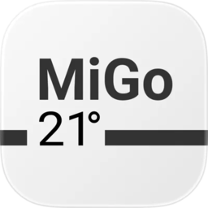

# MiGo (Netatmo) - Integration for Home Assistant

[](https://github.com/tomahoax/ha-migo-netatmo/releases)
[](https://github.com/tomahoax/ha-migo-netatmo/blob/main/LICENSE)
[](https://github.com/hacs/integration)
[](https://codecov.io/gh/tomahoax/ha-migo-netatmo)

Home Assistant integration for **Saunier Duval** thermostats controlled via the **MiGO** app (Netatmo API).

> [!WARNING]
> This integration is not affiliated with Saunier Duval or Netatmo. The developers take no responsibility for any issues that may occur with your devices following the use of this integration.

## Why this integration?

Many Saunier Duval users in France, Italy, and Spain have tried to use the excellent [myPyllant integration](https://github.com/signalkraft/mypyllant-component) to connect their thermostat to Home Assistant, only to face authentication failures despite valid credentials.

The reason? **The MiGo app uses a completely different API than myVAILLANT**. MiGo authenticates through the Netatmo API (`app.netatmo.net`), while myPyllant uses the Vaillant Identity infrastructure (`identity.vaillant-group.com`). These are two entirely separate and incompatible systems (see [myPyllant issue #336](https://github.com/signalkraft/mypyllant-component/issues/336)).

This integration was created to fill that gap by reverse-engineering the Netatmo API used by the MiGo iOS app.

## Use Cases

- **Energy tracking**: feed the *Daily boiler runtime* sensor into the Home Assistant Energy Dashboard to see how much your boiler actually runs, day over day (see [Energy Dashboard Integration](#energy-dashboard-integration)).
- **Remote control**: change the target temperature, switch modes (Auto/Heat/Off), or trigger a DHW boost from the Home Assistant app while away from home, instead of opening the MiGo app.
- **Fixing a miscalibrated room sensor**: use the per-room *Temperature offset* number entity to correct a thermostat that reads a few degrees off, without touching the physical device.
- **Fault alerting**: automate on the *Boiler error* or *eBus error* binary sensors to get a notification the moment something goes wrong, instead of noticing a cold house hours later (see [Automation Examples](#automation-examples)).
- **Presence-based heating**: combine the climate entity's preset modes (Away, Boost) with a Home Assistant presence automation to heat only when someone is actually home.
- **Battery monitoring**: get notified before a thermostat's battery runs out, rather than discovering it stopped reporting.

## Compatibility

> [!IMPORTANT]
> This integration is **ONLY** intended for users of the iOS/Android app:
>
> **[MiGo](https://apps.apple.com/app/migo-your-heating-assistant/id1023682652)**
>
> This integration **DOES NOT WORK** with the **MiGO Link** app (different API).

### How to identify which app you use?

| Application | Icon | This integration |
|-------------|:----:|------------------|
| **MiGo** |  | **Compatible** |
| **MiGO Link** |  | Not compatible |

### Tested boilers

- Saunier Duval Isotwin Condens 25-A

## Features

### Device Architecture

This integration creates **two separate devices** in Home Assistant:

1. **Gateway (NAVaillant)** - The main communication hub
   - Connected to your boiler via eBus
   - Provides WiFi connectivity
   - Controls DHW (Domestic Hot Water)

2. **Thermostat (NAThermVaillant)** - The wall-mounted thermostat
   - Connected to the Gateway via RF (radio)
   - Battery powered
   - Measures room temperature
   - Linked to Gateway via `via_device` relationship

### Climate Entity

- Display current temperature
- Set target temperature
- Change mode:
  - **Auto** (Schedule mode)
  - **Heat** (Manual mode)
  - **Off** (Frost guard)
- Preset modes:
  - **Away** - Away mode
  - **Frost guard** - Minimum temperature protection
  - **Boost** - Forces maximum temperature (30°C) for 1 hour

### Sensors

#### Gateway Sensors
- Outdoor temperature
- WiFi signal strength
- Gateway firmware version

#### Thermostat Sensors
- Temperature sensor per room
- Humidity sensor per room (if available)
- Battery level
- RF signal strength
- Thermostat firmware version

#### Energy Consumption
- **Daily boiler runtime** - Tracks boiler operation time in seconds (compatible with Energy Dashboard via `state_class: total_increasing`)

### Switches

- **DHW boost** (hot water boost) - Gateway
- **Heating anticipation** (enable/disable) - Home setting

### Number Controls (Configuration)

#### Gateway Controls
- **DHW temperature** (45°C - 60°C)
- **Hysteresis threshold** (0.1°C - 2.0°C)

#### Home Controls
- **Manual setpoint duration** (5 min - 12 hours)

#### Room Controls
- **Temperature offset** per room (-5.0°C to +5.0°C)

### Binary Sensors

#### Gateway Binary Sensors
- eBus error
- Boiler error

#### Thermostat Binary Sensors
- Boiler status (running/idle)
- Device reachable

### Select

- Active schedule

### Button

- Manual refresh

## Configuration Options

After installation, you can configure the integration options:

1. Go to **Settings** → **Devices & services**
2. Find **MiGo (Netatmo)** and click **Configure**
3. Adjust the following settings:

| Option | Description | Range | Default |
|--------|-------------|-------|---------|
| **Update interval** | How often to poll the API for updates | 60 - 3600 seconds | 300 seconds (5 min) |

> [!TIP]
> Lower polling intervals provide more responsive updates but may increase API load. A 5-minute interval is recommended for normal use.

### Changing credentials

Credentials are no longer edited in the options dialog. To change your email, password or OAuth settings:

1. Go to **Settings** → **Devices & services** → **MiGo (Netatmo)**
2. Open the entry menu (three dots) and select **Reconfigure**

If your password expired, Home Assistant shows a **Reauthenticate** repair instead; follow it to re-enter the password.

## Data Updates

This integration is **cloud polling**: it periodically calls the Netatmo API used by the MiGo app, there is no push/webhook mechanism. Each refresh cycle:

1. Fetches real-time status (`/api/homestatus`) - room temperatures, setpoints, connectivity, boiler status.
2. Fetches module configuration (`/syncapi/v1/getconfigs`) - DHW setpoint temperature and similar settings not present in the status response.
3. Fetches consumption history (`/api/getmeasure`) - boiler runtime for the Energy Dashboard sensor.

The default interval is **5 minutes (300 seconds)**, configurable between 60 and 3600 seconds (see [Configuration Options](#configuration-options)). A shorter interval gives more responsive updates at the cost of more API calls; a longer interval reduces load on the (unofficial, reverse-engineered) API.

Between scheduled refreshes, the **Manual refresh** button entity forces an immediate update - useful right after changing something in the MiGo app itself. If a refresh fails (network issue, expired token), affected entities go `unavailable` and the failure is logged once; they recover automatically on the next successful refresh.

## Installation

### HACS (Recommended)

[HACS](https://hacs.xyz/) (Home Assistant Community Store) is the recommended way to install this integration.

[](https://my.home-assistant.io/redirect/hacs_repository/?owner=tomahoax&repository=ha-migo-netatmo&category=integration)

1. Click the button above to add this custom repository to HACS
2. Install the **MiGo (Netatmo)** integration from HACS
3. **Restart Home Assistant** (Settings → System → Restart)

<details>
<summary>Manual HACS installation (if button doesn't work)</summary>

#### Prerequisites

- HACS must be installed in your Home Assistant instance
- If you don't have HACS yet, follow the [official HACS installation guide](https://hacs.xyz/docs/use/)

#### Step 1: Add the custom repository

1. Open Home Assistant and go to **HACS** in the sidebar
2. Click on **Integrations**
3. Click the **⋮** (three dots menu) in the top right corner
4. Select **Custom repositories**
5. In the dialog that opens:
   - **Repository**: `https://github.com/tomahoax/ha-migo-netatmo`
   - **Category**: Select `Integration`
6. Click **Add**

#### Step 2: Install the integration

1. Still in HACS → Integrations, click **+ Explore & Download Repositories**
2. Search for **"MiGo"** or **"MiGo Netatmo"**
3. Click on the integration in the search results
4. Click **Download** in the bottom right corner
5. Select the latest version and click **Download**
6. **Restart Home Assistant** (Settings → System → Restart)

</details>

### Configure the integration

After restart:

1. Go to **Settings** → **Devices & services**
2. Click **+ Add Integration**
3. Search for **"MiGo"**
4. Enter your MiGO app credentials (email and password)
5. Click **Submit**

Your devices should now appear in Home Assistant!

### Advanced Configuration

You can optionally provide custom OAuth credentials:

- **Client ID** (optional) - Custom OAuth client ID
- **Client Secret** (optional) - Custom OAuth client secret

Leave these empty to use the default MiGO app credentials.

> [!NOTE]
> The default client ID/secret are the MiGO iOS app's own OAuth credentials
> (extracted through reverse engineering, see [Technical Details](#technical-details)),
> not per-user secrets. They are committed in `const.py` and world-readable, and are
> required for this unofficial integration to authenticate at all. They do not grant
> access to any account by themselves: authentication still requires your own MiGO
> username and password. Use the advanced fields above only if you have your own
> client credentials and prefer not to rely on the bundled ones.

### Switching to a pre-release (dev) build

Development happens on the `dev` branch, and pre-releases are published from it so
you can try changes before they reach a stable version. HACS cannot install a git
branch directly, only published versions, so `dev` reaches you as a pre-release tag
such as `v0.42.0-beta.1`.

Pre-releases are hidden by default, so nothing changes unless you opt in.

**To switch to a pre-release:**

1. Go to **HACS** → **Integrations** and click **MiGo (Netatmo)**
2. Open the **⋮** menu (top right) and enable the option to show beta or
   pre-release versions
3. Open the **⋮** menu again and choose **Redownload**
4. Pick the pre-release version (the one with a `-beta` suffix) and confirm
5. **Restart Home Assistant**

**To go back to a stable build**, repeat the same steps and pick the highest version
without a `-beta` suffix. Turning the beta option back off stops new pre-releases
from being offered, but does not by itself downgrade what you already installed.

> [!NOTE]
> Your configuration, entities and history are untouched by switching versions: only
> the integration's files are replaced. Downgrading is safe as long as the stable
> version you return to is one you ran before.

> [!WARNING]
> Pre-releases are for testing. They are expected to work, but they have not been
> through a stable release cycle. If you hit a problem, please
> [open an issue](https://github.com/tomahoax/ha-migo-netatmo/issues) mentioning the
> exact version, then switch back to the latest stable build.

### Manual Installation

If you prefer not to use HACS, note that each release publishes two different
archives and they have different layouts:

- **`migo_netatmo.zip`** (release asset) - the integration's files at the archive
  root, which is the layout HACS requires
- **`Source code (zip)`** (generated by GitHub) - the whole repository, including
  the `custom_components/migo_netatmo/` folder

Using the release asset:

1. Download `migo_netatmo.zip` from the [latest release](https://github.com/tomahoax/ha-migo-netatmo/releases)
2. Create a `migo_netatmo` folder inside your Home Assistant `config/custom_components/` directory
3. Extract the archive's contents into that folder, so that `manifest.json` sits directly in it
4. Restart Home Assistant
5. Configure the integration via Settings → Devices & services → Add Integration

Using the source archive instead, extract it and copy its
`custom_components/migo_netatmo` folder into your `config/custom_components/`
directory, then restart and configure as above.

## Removing the Integration

1. Go to **Settings** → **Devices & services**
2. Find **MiGo (Netatmo)** and open the entry menu (three dots)
3. Select **Delete**

This removes the config entry along with its devices and entities from Home Assistant. There is nothing to unpair physically: this integration connects to your MiGO account over the cloud API, it does not hold a device pairing.

If you installed via HACS and want to remove the integration files too, remove it from HACS → Integrations after deleting the config entry. If you installed manually, delete the `custom_components/migo_netatmo` folder and restart Home Assistant.

Deleting the Home Assistant integration does **not** revoke access on the MiGO side; your account credentials remain valid for the MiGO app itself. There is no per-integration access token to revoke separately since authentication uses your regular MiGO username and password.

## Energy Dashboard Integration

The **Daily boiler runtime** sensor can be used to track heating usage in the Home Assistant Energy Dashboard:

1. Go to **Settings** → **Dashboards** → **Energy**
2. Under **Gas consumption** or **Individual devices**, add the boiler runtime sensor
3. The sensor uses `state_class: total_increasing` for proper energy tracking

> [!NOTE]
> The sensor reports boiler runtime in seconds. To estimate energy consumption, you can create a template sensor that multiplies runtime by your boiler's power rating.

Example template sensor for estimated gas consumption:
```yaml
template:
  - sensor:
      - name: "Estimated Gas Consumption"
        unit_of_measurement: "kWh"
        device_class: energy
        state_class: total_increasing
        state: >
          
            {# Adjust to your boiler's power #}
          {{ (runtime_seconds / 3600 * boiler_power_kw) | round(2) }}
```

## Automation Examples

Entity IDs below follow this integration's default naming (`<home>_<device>_<sensor>`); adjust them to match your own home and device names.

### Notify on low thermostat battery

```yaml
automation:
  - alias: "MiGo: low thermostat battery"
    trigger:
      - trigger: numeric_state
        entity_id: sensor.my_home_thermostat_battery
        below: 15
    action:
      - action: notify.mobile_app_your_phone
        data:
          title: "Thermostat battery low"
          message: "{{ trigger.to_state.name }} is at {{ trigger.to_state.state }}%."
```

### Notify on boiler error

```yaml
automation:
  - alias: "MiGo: boiler error"
    trigger:
      - trigger: state
        entity_id: binary_sensor.my_home_gateway_boiler_error
        to: "on"
    action:
      - action: notify.mobile_app_your_phone
        data:
          title: "Boiler error"
          message: "The MiGo gateway reported a boiler error."
```

### Notify on eBus communication error

```yaml
automation:
  - alias: "MiGo: eBus error"
    trigger:
      - trigger: state
        entity_id: binary_sensor.my_home_gateway_ebus_error
        to: "on"
    action:
      - action: notify.mobile_app_your_phone
        data:
          title: "MiGo communication error"
          message: "The gateway lost communication with the boiler over eBus."
```

### Switch to Away mode when everyone leaves

```yaml
automation:
  - alias: "MiGo: away mode when nobody home"
    trigger:
      - trigger: state
        entity_id: zone.home
        to: "0"
    action:
      - action: climate.set_preset_mode
        target:
          entity_id: climate.my_home_thermostat_thermostat
        data:
          preset_mode: away
```

## Troubleshooting

### Authentication failed

- Verify that your credentials work in the MiGO app
- Make sure you are using the correct app (MiGo. Your Heating Assistant, not MiGO Link)
- Check that at least one home is configured in your account

### No entities appear

- Check Home Assistant logs for errors
- Verify that your thermostat is properly connected in the MiGO app

### Two devices not showing

- Make sure you have both a gateway (NAVaillant) and thermostat (NAThermVaillant) in your MiGO setup
- The integration will only create devices for modules found in the API response

### Enable debug logs

Add this to your `configuration.yaml` and restart Home Assistant:

```yaml
logger:
  default: warning
  logs:
    custom_components.migo_netatmo: debug
```

## Technical Details

This integration uses the Netatmo API (`app.netatmo.net`) which is the backend for the MiGO app. It was developed through reverse engineering of the iOS app to provide a Home Assistant integration for users who cannot use the myVAILLANT/MiGO Link ecosystem.

### API Endpoints Used

| Endpoint | Purpose |
|----------|---------|
| `/oauth2/token` | Authentication |
| `/api/homesdata` | Home structure and configuration |
| `/api/homestatus` | Real-time status |
| `/api/getmeasure` | Historical data and consumption |
| `/api/setstate` | Control room temperature and DHW |
| `/api/setthermmode` | Set global mode |
| `/api/sethomedata` | Home settings (anticipation, duration) |
| `/syncapi/v1/setconfigs` | DHW temperature, offsets |
| `/api/changeheatingalgo` | Hysteresis settings |

## Contributing

Contributions are welcome! Please feel free to submit a Pull Request.

## License

This project is licensed under the MIT License - see the [LICENSE](LICENSE) file for details.

This integration is provided as-is, without warranty. Use at your own risk.
